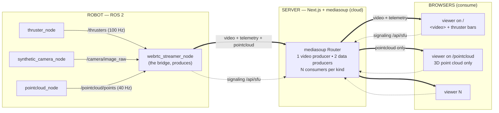
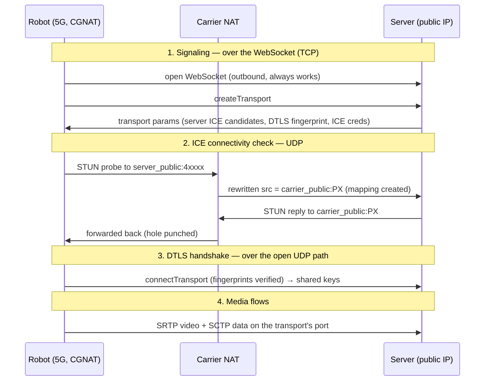
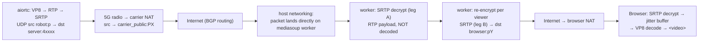

# web-rtc-test

Live streaming from a single robot to many web browsers with **low latency**.

The robot sends a video feed, fast-updating numbers (thruster values, 100 times
a second), and a live 3D point cloud. A server in the cloud relays all of it to
every browser that's watching.
The robot sends its data **once**; the server makes the copies. So one viewer or
fifty, the robot's workload is the same.

The forwarding engine on the server is **mediasoup**, a purpose-built SFU
library. (An earlier version of this project used a hand-rolled forwarder on top
of `werift`; see the git history for that design and why it was replaced.)

---

## Vocabulary (plain language)

You don't need a networking background. Here's every term used below, in one place.

- **WebRTC** — the technology browsers already have built in for real-time
  audio/video/data (it's what video-call apps use). It lets two programs send
  live data directly to each other. We use it for both the video and the numbers.
- **Peer** — one end of a *single* WebRTC connection (the robot, the server, or a
  browser). **The robot never talks straight to the browser.** There are two
  separate connections — robot↔server and server↔browser — and the server is a
  peer on both. The robot→browser path is always **two hops, through the server**
  (that's what makes the server an SFU / middleman).
- **SFU (Selective Forwarding Unit)** — a server that receives one media stream
  and forwards copies to many viewers, **without re-compressing** it. The
  alternative — the robot sending a separate stream to each browser — would
  overload the robot.
- **mediasoup** — the SFU library we use on the server. Its terms, which appear
  everywhere below:
  - **Worker** — a separate native process (written in C++) that mediasoup
    launches to do all the actual packet forwarding. The Node.js server just
    tells it what to do.
  - **Router** — a "room" inside a worker. Everything here lives in one router:
    one robot, many viewers.
  - **Transport** — one peer's connection into the router. Each peer creates its
    own.
  - **Producer** — a stream a peer sends *into* the router (the robot's video).
  - **Consumer** — a copy of a producer that a peer receives *out of* the router
    (each browser's copy of the video).
  - **Data producer / data consumer** — the same idea for arbitrary messages
    instead of video (the thruster numbers, the point clouds).
- **Media track** — a live stream of video (or audio). Here: the robot's camera.
- **Data channel** — a side pipe on the same connection for sending arbitrary
  messages (here: the thruster numbers as small chunks of JSON, and the point
  clouds as binary messages).
- **Signaling** — the setup conversation a peer has with the server *before* the
  real connection opens (what codecs, what network addresses, "please give me a
  copy of the video"). We do this over a **WebSocket** (a normal always-open
  text connection) at `/api/sfu`.
- **Reliable vs. unreliable delivery** — a data channel can guarantee every
  message arrives in order (like email), or it can favor speed and *drop* old
  data if the network hiccups (like a live phone call). We use both: the 100 Hz
  thruster values are **unreliable** (stale numbers are useless — always get the
  newest), while the point clouds are **reliable** — each cloud is big enough
  to be split into many pieces on the wire, and unreliable delivery would lose
  most of them. "Newest wins" for clouds is enforced on the robot instead (see
  the bridge section).
- **Encoding / codec (VP8)** — compressing video so it fits over the network.
  VP8 is the specific compression format; every browser can play it. The robot
  encodes once; nobody re-encodes after that.
- **NAT / reachability** — most machines sit behind a router and don't have a
  directly-reachable public address. WebRTC has a built-in negotiation to find a
  working path between two peers. On a cloud server with a public address this is
  easy; the deployment notes cover the settings it needs.
- **Client libraries** — `mediasoup-client` is the browser-side companion to
  mediasoup; `pymediasoup` is the Python equivalent used on the robot (it drives
  `aiortc`, a Python WebRTC implementation, under the hood); `rclpy` is the
  Python library for talking to ROS 2 (the robot's software framework).

---

## Topology



_Thick arrows = the live video and data. Dotted arrows = the signaling
WebSocket, used for setup and for "a new stream appeared" notifications._

The design in one sentence: **the robot *produces* its streams into the server's
router once, and every browser *consumes* only the streams it wants.**

Two properties fall out of this:

1. **The robot's work is constant.** It sends one video stream and one data
   stream to the server, no matter how many people watch. The server's C++
   worker makes the per-viewer copies without ever decompressing the video.
2. **Browsers subscribe selectively.** A browser is told what producers exist
   (`newProducer` / `newDataProducer` events, or a `getProducers` request when
   joining late) and asks to consume only what its screen needs. The main page
   (`/`) consumes the video and the `telemetry` data stream; the `/pointcloud`
   page consumes only the `pointcloud` data stream, and the server never sends
   it video or telemetry.

---

## Robot — sending data

The robot runs ROS 2 (its control software). Code: `robot/ros2_ws`.

### The data sources (ordinary robot programs)

| Program | Publishes | What it is | Rate |
|---------|-----------|------------|------|
| `thruster_node` | `/thrusters` | 4 thruster values (with a timestamp) | 100 per second |
| `synthetic_camera_node` | `/camera/image_raw` | camera frames (a fake animated image; no real camera needed) | 30 per second |
| `pointcloud_node` | `/pointcloud/points` | an animated 3D point cloud (~2,900 points: a rippling wave surface plus a spinning helix; no real sensor needed) | 40 per second |

These three know nothing about the web or WebRTC. They just publish data on
named channels (ROS calls them *topics*), like any robot sensor would.

### The bridge — `webrtc_streamer_node`

This is the program that turns robot data into WebRTC streams. It is a
**mediasoup producer client** (`pymediasoup` + `aiortc`). It:

- **Subscribes** to `/thrusters`, `/camera/image_raw`, and `/pointcloud/points`
  (listens to the three sources above).
- Connects to the server's signaling WebSocket (`/api/sfu`), loads the router's
  capabilities, creates a **send transport**, and then:
  - **produces video** — each camera frame becomes a frame on a video track,
    compressed to VP8 by `aiortc`. To avoid lag, only the **newest** frame ever
    waits to be sent — if compression falls behind, old frames are dropped, not
    queued.
  - **produces data** — each thruster reading becomes a small JSON message
    `{"t": timestamp, "v": [v0, v1, v2, v3]}` on a data producer labelled
    `telemetry`, created **unreliable** (unordered, no retransmits — newest
    data wins).
  - **produces a second data stream** — each point cloud becomes one binary
    message (an 8-byte timestamp followed by the points as raw `float32`
    x,y,z) on a data producer labelled `pointcloud`. Unlike telemetry, this
    one is **reliable and ordered**: a cloud (~35 KB) gets split into many
    pieces on the wire, and unreliable delivery would lose most clouds
    entirely. "Newest wins" is enforced on the robot instead — if the channel
    is still busy sending an earlier cloud, the new one is dropped, not
    queued, so a slow network can never build up lag.
- **Auto-reconnects** every few seconds, so it survives the server restarting.

One technical detail worth knowing: the robot's WebRTC stack is asynchronous,
while ROS delivers data on a separate thread. The bridge safely hands data from
the ROS thread over to the WebRTC side (`loop.call_soon_threadsafe`).
Implementation:
`robot/ros2_ws/src/webrtc_streamer_pkg/.../webrtc_streamer_node.py`.

---

## Server — receiving and forwarding

The server is a Next.js web app (`server/`) with mediasoup embedded — mediasoup
is a library, and its native `mediasoup-worker` process runs as a subprocess of
the server. The server code is two files:

- `server/src/lib/mediasoup/sfu.ts` — owns the worker, the router, the shared
  producer registry, and a `Peer` class (one per WebSocket connection) that
  translates signaling messages into mediasoup calls.
- `server/src/lib/mediasoup/config.ts` — worker/router/transport settings,
  driven by environment variables (ports, public address, codec).

There is **one worker and one router** — a single room. The router accepts VP8
video only (matching the robot and every browser).

### What the Node.js side actually does

Almost nothing per-packet. The signaling handler is a small request/response
protocol (see below) whose handlers just call into mediasoup: create a
transport, connect it, create a producer/consumer. After that, **all
forwarding — video packets and data messages alike — happens inside the C++
worker.** There is no application-level "loop over viewers and send" anywhere;
creating a data consumer is enough, and the worker fans the messages out.

Details that keep it smooth:

- Video is forwarded at the packet level, **never decompressed**. Each browser's
  connection has its own encryption, so the worker re-seals each copy — that
  re-encryption (not decoding) is the per-viewer cost.
- New consumers start **paused** and the browser resumes them once its side is
  wired up, so no early frames are lost. mediasoup handles requesting a fresh
  keyframe from the robot so late joiners see a clean picture quickly.
- Because the data streams are unreliable, a slow browser never causes a
  backlog — it just misses a few updates and catches up with the next one.

### Presence and health

- When the robot connects and produces, every browser gets `newProducer` /
  `newDataProducer` events; when it disconnects, they get `producerClosed`.
  The browser page uses these to show/hide its "Robot offline" overlay — there
  is no separate presence message.
- `GET /api/status` returns
  `{ "ready": bool, "peers": n, "producers": n, "dataProducers": n }`
  for quick health checks. `peers` counts every connected WebSocket (robot and
  viewers alike); `producers: 1, dataProducers: 2` means the robot is live
  (one video, plus the `telemetry` and `pointcloud` data streams).

---

## Client — receiving and displaying

There are two browser pages (React + MUI + `mediasoup-client`), which share the
connection helpers in `server/src/lib/sfuClient.ts`:

- **`/`** (`app/page.tsx`) — the main viewer: video + thruster bars.
- **`/pointcloud`** (`app/pointcloud/page.tsx`) — a 3D point-cloud view. It
  consumes *only* the `pointcloud` data stream — no video, no telemetry —
  selective subscription in action: the server never sends this page the
  streams it doesn't ask for.

### Connecting (shared code in `sfuClient.ts`)

1. Fetch `/api/ice-config` — the list of STUN/TURN helper servers (TURN only if
   configured; see deployment).
2. Open the signaling WebSocket `/api/sfu` and load a `mediasoup-client`
   `Device` with the router's capabilities.
3. Create a **receive transport** (one per browser; it carries everything).
4. Ask `getProducers` for anything already streaming, and listen for
   `newProducer` / `newDataProducer` events for anything that appears later.
5. For each producer the page wants (it picks by the producer's label —
   `telemetry` or `pointcloud`): video → request `consume`, attach the
   resulting track, then `resumeConsumer`; data → request `consumeData` and
   read messages.

### Displaying

- **Video** — the consumed video track is attached to a normal HTML `<video>`
  element. The browser decompresses and plays it natively.
- **Thruster numbers** — each `telemetry` message is parsed: the four values are
  stored (messages with an older timestamp than the last one seen are ignored —
  unreliable delivery can reorder), and a screen-refresh loop (~60 times a
  second) redraws four bars. This is deliberately **decoupled** from the
  100-per-second data rate, so the page redraws smoothly instead of 100 times a
  second. A live "Hz" readout shows the actual message rate.
- **Point cloud** (`/pointcloud`) — each binary message is unpacked (the
  timestamp, then the `float32` x,y,z points; clouds older than the last one
  shown are dropped) and drawn on a plain 2D `<canvas>` with a small
  hand-rolled perspective projection — no 3D library. Drag to orbit, scroll to
  zoom; points are colored by height. Like the bars, drawing runs at
  screen-refresh rate, decoupled from the 40 Hz arrival rate.
- **Presence** — a `producerClosed` event dims the view and shows a
  "Robot offline" overlay.

---

## The signaling protocol

Everything on the `/api/sfu` WebSocket is JSON. Requests carry an `id` and an
`action`; the server replies with the same `id` and `ok: true/false`. The server
also pushes unsolicited **events** (no `id`).

```
client → server   { "id": 1, "action": "getRtpCapabilities" }
server → client   { "id": 1, "ok": true, "data": { …codecs… } }
```

| Action | Who uses it | What it does |
|--------|-------------|--------------|
| `getRtpCapabilities` | both | what codecs the router speaks |
| `createTransport` | both | make my connection into the router |
| `connectTransport` | both | finish that connection's encryption setup |
| `produce` / `produceData` | robot | register my video / telemetry stream |
| `getProducers` | browser | what's already streaming? (late join) |
| `consume` / `consumeData` | browser | give me a copy of that stream |
| `resumeConsumer` | browser | I'm wired up, start the video |

Events pushed by the server: `newProducer`, `newDataProducer`,
`producerClosed`, `dataProducerClosed`, `consumerClosed`.

The **actual robot data** travels on the data streams, *not* on this signaling
connection:

```
robot → router → browsers   { "t": …, "v": [v0,v1,v2,v3] }        telemetry (JSON), 100 Hz
robot → router → browsers   [f64 timestamp][f32 x,y,z × points]   pointcloud (binary), 40 Hz
```

---

## Running

### Server (development)
```bash
cd server
npm install          # downloads the prebuilt mediasoup worker
npm run dev          # http://localhost:3000
```

### Robot (inside the dev container)
```bash
cd robot/ros2_ws
colcon build --symlink-install
source install/setup.bash
ros2 launch robot_bringup sensors.launch.py     # the data sources
ros2 launch robot_bringup webrtc.launch.py      # defaults to ws://localhost:3000/api/sfu
```

To point the robot at another server:
`ros2 launch robot_bringup webrtc.launch.py signaling_url:=ws://<host>:3000/api/sfu`
— or use `webrtc_prod.launch.py`, which defaults to the deployed server.

Then open the server's URL in one or more browsers — the main page at `/`,
the point-cloud view at `/pointcloud`.

---

## Deployment (cloud)

Deployed with Docker Compose using **host networking** — mediasoup's media ports
must be directly reachable and advertise the real public IP, and Docker's NAT
would get in the way. Full instructions live in [`deploy/README.md`](deploy/README.md);
the short version:

```yaml
services:
  gui:
    image: ghcr.io/emil1483/web-rtc-test:${TAG}
    restart: unless-stopped
    network_mode: host
    environment:
      - MEDIASOUP_ANNOUNCED_IP=<server public address>  # what peers connect to
      - MEDIASOUP_LISTEN_IP=0.0.0.0
      - MEDIASOUP_RTC_MIN_PORT=40000                     # media/data port range
      - MEDIASOUP_RTC_MAX_PORT=40100
```

Open in the firewall: **TCP** for the web app/signaling port, and
**UDP + TCP 40000–40100** for the media. mediasoup also answers on **TCP** in
that range (ICE-TCP), which gets clients on UDP-hostile networks (guest wifi,
some mobile carriers) through without a relay server — so a TURN relay (coturn)
is optional and off by default. If some client network still fails, enable the
coturn service in `deploy/compose.yml` and set `TURN_URLS` / `TURN_USERNAME` /
`TURN_CREDENTIAL`; browsers pick these up via `/api/ice-config`.

One image caveat: mediasoup ships a prebuilt native worker for **glibc** Linux
only, so the Docker image uses `node:22-bookworm-slim` (not Alpine).

---

## How many viewers can it handle?

One robot; the question is viewers. Limits, in the order you'd hit them:

1. **Port range** — each peer's transport uses one port from the RTC range. The
   range above (~100 ports) allows ~100 peers. Widen the range (and the
   firewall) to raise it.
2. **Worker CPU** — one mediasoup worker uses one CPU core and comfortably
   forwards a single video stream to **hundreds** of viewers (it's C++ and
   never decodes). Past that, mediasoup scales by running one worker per core
   and spreading viewers across them — a server-only change.
3. **Bandwidth** — the server sends one full video copy per viewer. This is
   usually the real ceiling: 100 viewers × 1 Mbit/s video = 100 Mbit/s upload.

The robot side never changes: it always sends exactly one copy of everything.

---

## Appendix — packet-level deep dive (optional)

> This section assumes networking familiarity and uses the standard terms. The
> rest of the README does not depend on it. Scenario: the robot is on **5G**, the
> server is a cloud VM with a **public IP**, the browser is on some home/office
> network.

Acronyms used here: **NAT** (address translation in a router), **CGNAT**
(carrier-grade NAT — the carrier shares one public IP across many customers),
**UDP/TCP** (connectionless / connection-oriented transports), **ICE** (WebRTC's
path-finding), **STUN** (a peer discovering its own public address), **DTLS**
(TLS over UDP — the encryption handshake), **RTP/SRTP** (real-time media packets
/ their encrypted form), **SCTP** (the transport under data channels).

### Two legs, one middle

Each leg is set up and encrypted independently; the server terminates both.

```
robot ──leg A── server (public IP) ──leg B── browser
```

The key asymmetry: the robot (behind CGNAT) has **no inbound reachability**; the
server **does**. So every leg is "a hidden peer reaching a public peer," which is
the easy case — no TURN relay needed. mediasoup is an **ICE-lite** endpoint: it
never initiates connectivity checks, it just answers them on its announced
address, which is exactly right for a server that's always publicly reachable.

### Establishing one leg (robot ↔ server)



- The transport params carry the server's candidates (public `IP:port` from the
  RTC range, both UDP and TCP), its DTLS cert fingerprint, and ICE credentials.
- **ICE** works because the robot speaks first to the server's known public
  address; the carrier NAT then permits the reply on that mapping. If UDP is
  blocked entirely, the client falls back to the server's **TCP** candidate.
- **DTLS** verifies each cert against the fingerprint from signaling (stops
  man-in-the-middle) and derives the media keys.
- Leg B (server ↔ browser) is the identical procedure, independently, with its
  own keys.

### One video packet, end to end (data plane)



The server is the **encryption boundary**: the worker briefly holds the
compressed-but-decrypted RTP in memory and re-seals a copy per viewer. It never
decompresses the video — that per-viewer re-encryption (not decoding) is the CPU
cost. The thruster data follows the same paths as SCTP instead of SRTP, also
fanned out inside the worker.

### Details that keep it working
- **NAT bindings expire** → continuous RTP plus periodic STUN keepalives hold
  both mappings open.
- **One port per transport** on the server; robot and browser each use one
  ephemeral port.
- **Two crypto domains** — a capture on leg A can't be decrypted with leg B keys;
  only the server holds both.
- **Latency budget** — 5G radio (~10–30 ms) + carrier→internet + server
  (near-zero, no transcode) + browser jitter buffer (~tens of ms).

---

## Project layout

```
robot/ros2_ws/src/
  my_interfaces/          # Thrusters message (4 values + timestamp)
  thruster_pkg/           # thruster_node        → /thrusters (100 Hz)
  camera_pkg/             # synthetic_camera_node → /camera/image_raw
  pointcloud_pkg/         # pointcloud_node      → /pointcloud/points (40 Hz)
  webrtc_streamer_pkg/    # webrtc_streamer_node  → the bridge (pymediasoup producer)
  robot_bringup/          # launch files (webrtc.launch.py, webrtc_prod.launch.py)
server/src/
  app/api/sfu/route.ts         # signaling WebSocket endpoint (robot & viewers)
  app/api/ice-config/route.ts  # STUN/TURN list for browsers
  app/api/status/route.ts      # health check
  lib/mediasoup/sfu.ts         # worker/router + Peer signaling handlers
  lib/mediasoup/config.ts      # env-driven mediasoup settings
  lib/sfuClient.ts             # shared browser helpers (signaling RPC, connect, consume)
  app/page.tsx                 # main page (video + thruster bars)
  app/pointcloud/page.tsx      # 3D point-cloud page (consumes only "pointcloud")
deploy/                        # compose + deployment notes (see deploy/README.md)
```
