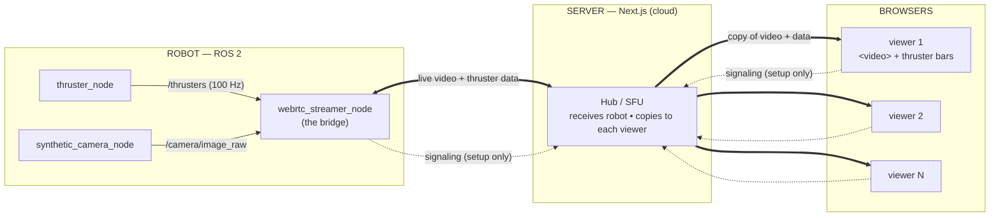
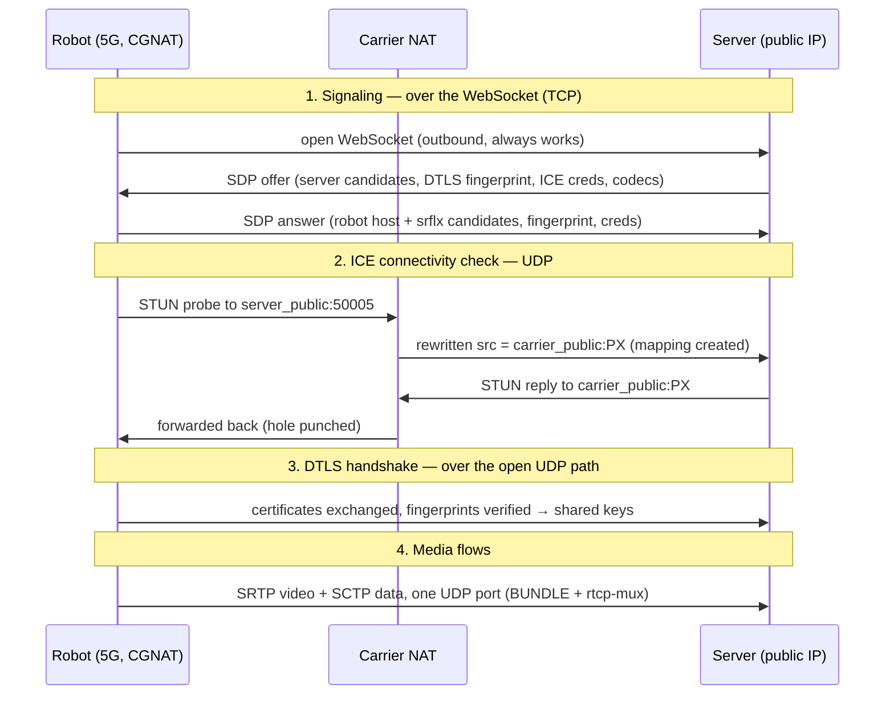

# web-rtc-test

Live streaming from a single robot to many web browsers with **low latency**.

The robot sends a video feed and fast-updating numbers (thruster values, 100 times
a second). A server in the cloud relays both to every browser that's watching.
The robot sends its data **once**; the server makes the copies. So one viewer or
fifty, the robot's workload is the same.

---

## Vocabulary (plain language)

You don't need a networking background. Here's every term used below, in one place.

- **WebRTC** — the technology browsers already have built in for real-time
  audio/video/data (it's what video-call apps use). It lets two programs send
  live data directly to each other. We use it for both the video and the numbers.
- **Peer** — one end of a *single* WebRTC connection (the robot, the server, or a
  browser). "Peer-to-peer" means one connection runs directly between its two
  peers. **It does not mean the robot talks straight to the browser.** In this
  system there are two separate connections — robot↔server and server↔browser —
  and the server is a peer on both. The robot→browser path is always **two hops,
  through the server** (that's what makes the server an SFU / middleman).
- **Media track** — a live stream of video (or audio). Here: the robot's camera.
- **Data channel** — a side pipe on the same connection for sending arbitrary
  messages (here: the thruster numbers, as small chunks of JSON).
- **Signaling** — the short "let's connect" conversation two peers have *before*
  the real connection opens. They swap a description of what they support (codecs,
  network addresses). We do this over a **WebSocket** (a normal always-open
  browser↔server text connection).
- **Reliable vs. unreliable delivery** — a data channel can guarantee every
  message arrives in order (like email), or it can favor speed and *drop* old
  data if the network hiccups (like a live phone call). For 100 Hz values, stale
  numbers are useless, so we choose **unreliable** — always get the newest.
- **SFU (Selective Forwarding Unit)** — a server that receives one media stream
  and forwards copies to many viewers, **without re-compressing** it. That's the
  role our server plays. The alternative — the robot sending a separate stream to
  each browser — would overload the robot.
- **Encoding / codec (VP8)** — compressing video so it fits over the network.
  VP8 is the specific compression format; every browser can play it. The robot
  encodes once; nobody re-encodes after that.
- **NAT / reachability** — most machines sit behind a router and don't have a
  directly-reachable public address. WebRTC has a built-in negotiation to find a
  working path between two peers. On a cloud server with a public address this is
  easy; the deployment notes cover the one setting it needs.
- **werift / aiortc / rclpy** — the libraries we use: `werift` is a WebRTC
  implementation for the server (JavaScript), `aiortc` is one for the robot
  (Python), and `rclpy` is the Python library for talking to ROS 2 (the robot's
  software framework).

---

## Topology



_Thick arrows = the live video and data. Dotted arrows = the short setup
conversation that happens once, before the live connection opens._

Two design choices explain everything below:

1. **The server is an SFU.** The robot sends one video stream to the server. The
   server forwards copies to every browser. The robot never does more work as
   more people watch.
2. **The server always starts the connection.** For every peer (the robot and
   each browser), the *server* sends the first "here's what I offer" message and
   the other side replies. This matters because of the next point.

### Why the server starts every connection

The server's WebRTC library (`werift`) works reliably when it's the side that
*initiates* the connection, but hits a bug when it's the side that *responds* —
specifically when a video stream and a data channel share one connection, the
connection's encryption step never completes and nothing flows. Making the server
always initiate avoids the bug completely. (This was found the hard way; see the
git history.)

A direct consequence: **the server creates the data channels and declares the
video slots.** The robot and browsers just receive whatever the server set up.
More on this below.

---

## Robot — sending data

The robot runs ROS 2 (its control software). Code: `robot/ros2_ws`.

### The data sources (ordinary robot programs)

| Program | Publishes | What it is | Rate |
|---------|-----------|------------|------|
| `thruster_node` | `/thrusters` | 4 thruster values (with a timestamp) | 100 per second |
| `synthetic_camera_node` | `/camera/image_raw` | camera frames (a fake animated image; no real camera needed) | 30 per second |

These two know nothing about the web or WebRTC. They just publish data on named
channels (ROS calls them *topics*), like any robot sensor would.

### The bridge — `webrtc_streamer_node`

This is the program that turns robot data into a WebRTC stream. It:

- **Subscribes** to `/thrusters` and `/camera/image_raw` (listens to the two
  sources above).
- Turns each camera frame into a **video track** and lets `aiortc` compress it
  (VP8). To avoid lag, it only ever keeps the **newest** frame waiting to be
  sent — if compression falls behind, old frames are dropped, not queued.
- Turns each thruster reading into a small JSON message
  `{"t": timestamp, "v": [v0, v1, v2, v3]}` and sends it on the **data channel**.
- Acts as the **responder**: it connects to the server, waits for the server's
  connection offer, attaches its video, and replies. (Remember: the server
  always offers first.)
- **Auto-reconnects** every few seconds, so it survives the server restarting.

One technical detail worth knowing: the robot library (`aiortc`) is asynchronous,
while ROS delivers data on a separate thread. The bridge safely hands data from
the ROS thread over to the WebRTC side. Implementation:
`robot/ros2_ws/src/webrtc_streamer_pkg/.../webrtc_streamer_node.py`.

---

## Server — receiving and forwarding

The server is a Next.js web app (`server/`). The forwarding logic is one file:
`server/src/lib/webrtc/hub.ts` (the "Hub"). There's one shared Hub for the whole
server process.

### Who sets up what

Because the server initiates every connection, **the server is the one that
creates the data channels and the video slots.** Concretely:

- **For the robot's connection**, the server sets up:
  - an *incoming* video slot (to receive the robot's camera), and
  - a data channel named `telemetry` (unreliable — newest data wins).
  The robot fills these in when it responds.

- **For each browser's connection**, the server sets up:
  - an *outgoing* video slot (to send video to that browser), and
  - its own `telemetry` data channel.

So a browser doesn't create anything — it receives the server's video and the
server's data channel, and just reads from them.

### How the video forwarding actually works

This is the core of the SFU, and it's simpler than it sounds:

1. The robot's compressed video arrives at the server as a continuous stream of
   small packets. The server does **not** decompress it or look inside it.
2. The server holds **one object representing the robot's incoming video**.
3. Each browser has an **outgoing video sender** on its own connection. The
   server points every one of those senders at that **same** incoming robot
   video object.
4. From then on, whenever a video packet arrives from the robot, the library
   copies it out to every browser's sender. Each browser's connection has its
   own encryption, so each copy is re-sealed for that browser — but the video
   itself is never decompressed or re-compressed. That's why it's cheap and
   low-latency: **decode-free forwarding, one copy per viewer.**

When a new browser joins mid-stream, the server asks the robot to send a fresh
full frame (a "keyframe") so the new viewer sees a clean picture quickly instead
of garbage.

### How the data (thruster) forwarding works

The data channels are **not** copied automatically — the server does it in code:

1. The robot sends `{"t":…, "v":[…]}` on its `telemetry` channel.
2. The server receives that message and **loops over every browser**, sending the
   same text on each browser's `telemetry` channel.

Because the channels are unreliable, a slow browser never causes a backlog — it
just misses a few updates and catches up with the next one.

### Robot present / absent

- The server tracks whether the robot is connected. When a browser joins, the
  server tells it the current state; when the robot disconnects, the server tells
  all browsers `{"status":"offline"}` and stops feeding them the (now frozen)
  video.
- `GET /api/status` returns `{ "robot": true/false, "viewers": <count> }` for
  quick health checks.

---

## Client — receiving and displaying

The browser page is `server/src/app/page.tsx` (React + MUI).

### Connecting (the browser responds)

1. The browser opens the setup connection: `/api/signaling?role=viewer`.
2. The server sends its offer; the browser accepts it and replies.
3. The browser is handed a **video track** and a **data channel** (both created
   by the server).

### Displaying

- **Video** — the incoming video track is attached to a normal HTML `<video>`
  element. The browser decompresses and plays it natively.
- **Thruster numbers** — each data-channel message is parsed:
  - `{"v":[…]}` → the four values are stored, and a screen-refresh loop
    (~60 times a second) redraws four bars. This is deliberately **decoupled**
    from the 100-per-second data rate, so the page redraws smoothly instead of
    100 times a second. A live "Hz" readout shows the actual message rate.
  - `{"status":"online"/"offline"}` → shows/hides a "Robot offline" overlay and
    dims the video.

The browser needs no special library — WebRTC is built in.

---

## The setup conversation (signaling)

Before any video flows, the two peers exchange two short messages over the
WebSocket. The server always speaks first:

```
server → client   { "type": "offer",  "sdp": "…" }   (here's the connection I propose)
client → server   { "type": "answer", "sdp": "…" }   (accepted, here's my side)
```

(`sdp` is just a text description of the connection — codecs and network
addresses. We include all network addresses in that one message rather than
trickling them in later, to keep the exchange to a single round-trip.)

After those two messages, the live connection opens and the signaling WebSocket
is no longer needed for media. Each such connection is direct between its two
ends (robot↔server, and server↔browser) — but remember there are two of them, so
robot data still reaches a browser via the server, not directly.

The **actual robot/browser messages** (thruster values, status) travel on the
data channel, *not* on this signaling connection:

```
robot  → server → browsers   { "t": …, "v": [v0,v1,v2,v3] }   thruster values
server → browsers            { "status": "online" | "offline" }  robot presence
browser → server → robot     <command payload>                 (reserved; robot→ can receive commands)
```

---

## Running

### Server (development)
```bash
cd server
npm install          # sets up the WebSocket support automatically
npm run dev          # http://localhost:3000
```

### Robot (inside the dev container)
```bash
cd robot/ros2_ws
colcon build --symlink-install
source install/setup.bash
ros2 launch robot_bringup sensors.launch.py     # the data sources
ros2 launch robot_bringup webrtc.launch.py \
  signaling_url:=ws://<server-host>:3000/api/signaling?role=robot
```

Then open the server's URL in one or more browsers.

---

## Deployment (cloud)

Deployed with Docker Compose. One extra thing to know: live video/data uses many
short-lived network ports, and a container only exposes the ports you tell it to.
So we (a) fix the range of ports WebRTC may use, (b) expose that range, and
(c) tell the server its own public address so browsers know where to reach it.

```yaml
services:
  gui:
    image: ghcr.io/emil1483/web-rtc-test:${TAG}
    restart: unless-stopped
    environment:
      - PUBLIC_IP=<server public address>    # so peers get a reachable address
      - ICE_PORT_MIN=50000                    # range of ports WebRTC may use
      - ICE_PORT_MAX=50019
    ports:
      - "0.0.0.0:3001:3000"                   # web page + setup conversation
      - "50000-50019:50000-50019/udp"         # live video + data
```

Also open that port range in the host firewall. Because the server has a public
address, no relay server is needed.

---

## How many viewers can it handle?

One robot; the question is viewers. Limits, in the order you'd hit them:

1. **Port range** — the connection setup uses one port per viewer. The range above
   (20 ports) allows ~20 viewers. Widen the range (and the firewall) to raise it.
2. **Server CPU** — the server's WebRTC library is single-threaded and re-seals
   every video packet for every viewer. Realistic ceiling: a few **dozen**
   viewers (more if the video is small/low-quality). This is the real limit.
3. **Bandwidth** — the server sends one full video copy per viewer.

Past a few dozen viewers, the fix is to swap the server's forwarding engine for a
purpose-built one (e.g. mediasoup or LiveKit — multi-core, made for this). The
robot side wouldn't change.

---

## Appendix — packet-level deep dive (optional)

> This section assumes networking familiarity and uses the standard terms. The
> rest of the README does not depend on it. Scenario: the robot is on **5G**, the
> server is a cloud VM with a **public IP**, the browser is on some home/office
> network.

Acronyms used here: **NAT** (address translation in a router), **CGNAT**
(carrier-grade NAT — the carrier shares one public IP across many customers),
**UDP/TCP** (connectionless / connection-oriented transports), **ICE** (WebRTC's
path-finding), **STUN** (a peer discovering its own public address), **SDP** (the
text describing a connection), **DTLS** (TLS over UDP — the encryption handshake),
**RTP/SRTP** (real-time media packets / their encrypted form), **SCTP** (the
transport under data channels), **BUNDLE + rtcp-mux** (put everything on one
UDP port).

### Two legs, one middle

Each leg is set up and encrypted independently; the server terminates both.

```
robot ──leg A── server (public IP) ──leg B── browser
```

The key asymmetry: the robot (behind CGNAT) has **no inbound reachability**; the
server **does**. So every leg is "a hidden peer reaching a public peer," which is
the easy case — no TURN relay needed.

### Establishing one leg (robot ↔ server)



- **Signaling** carries candidates, the DTLS cert fingerprint, ICE credentials,
  and codecs. Robot candidates: `host` (its CGNAT `10.x` — externally useless)
  and `srflx` (its public mapping, learned via STUN). Server candidate: public
  `IP:50005`.
- **ICE** works because the robot speaks first to the server's known public
  address; the carrier NAT then permits the reply on that mapping.
- **DTLS** verifies each cert against the fingerprint from signaling (stops
  man-in-the-middle) and derives the media keys.
- Leg B (server ↔ browser) is the identical procedure, independently, with its
  own keys.

### One video packet, end to end (data plane)

```mermaid
flowchart LR
    A["aiortc: VP8 → RTP → SRTP<br/>UDP src robot:p → dst server:50005"]
    B["5G radio → gNodeB → UPF"]
    C["Carrier NAT<br/>src → carrier_public:PX"]
    D["Internet (BGP routing)"]
    E["Linode host<br/>iptables DNAT :50005 → container"]
    F["werift: SRTP decrypt (leg A)<br/>RTP payload, NOT decoded"]
    G["werift: re-encrypt per viewer<br/>SRTP (leg B) → UDP dst browser:pY"]
    H["Internet → browser NAT"]
    I["Browser: SRTP decrypt → jitter buffer<br/>→ VP8 decode → &lt;video&gt;"]
    A --> B --> C --> D --> E --> F --> G --> H --> I
```



The server is the **encryption boundary**: it briefly holds the
compressed-but-decrypted RTP in memory and re-seals a copy per viewer. It never
decompresses the video — that per-viewer re-encryption (not decoding) is the CPU
cost that caps viewer count. The thruster data channel follows the same UDP
paths as SCTP instead of SRTP, forwarded in application code (a loop over
viewers) rather than at the RTP layer.

### Details that keep it working
- **NAT bindings expire** → continuous RTP plus periodic STUN keepalives hold
  both mappings open.
- **One UDP port per connection** on the server (BUNDLE + rtcp-mux); robot and
  browser each use one ephemeral UDP port.
- **Two crypto domains** — a capture on leg A can't be decrypted with leg B keys;
  only the server holds both.
- **Latency budget** — 5G radio (~10–30 ms) + carrier→internet + server
  (near-zero, no transcode) + browser jitter buffer (~tens of ms).

---

## Project layout

```
robot/ros2_ws/src/
  my_interfaces/          # Thrusters message (4 values + timestamp)
  thruster_pkg/           # thruster_node        → /thrusters (100 Hz)
  camera_pkg/             # synthetic_camera_node → /camera/image_raw
  webrtc_streamer_pkg/    # webrtc_streamer_node  → the bridge (video + data)
  robot_bringup/          # launch files
server/src/
  app/api/signaling/route.ts   # the setup-conversation endpoint (robot & viewers)
  app/api/status/route.ts      # health check
  lib/webrtc/hub.ts            # the SFU: receive robot, forward to viewers
  app/page.tsx                 # the browser page (video + thruster bars)
```
