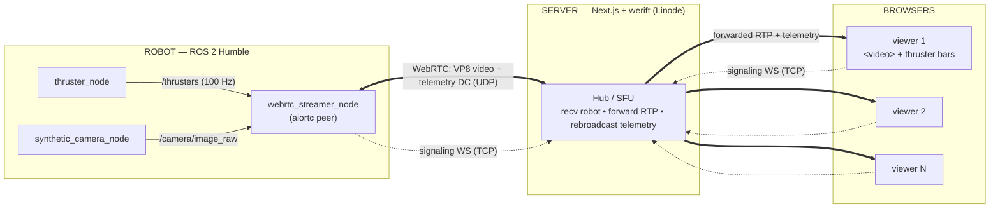

# web-rtc-test

Low-latency, high-bandwidth streaming from a ROS 2 robot to many web browsers
over **WebRTC**, with the server acting as a **selective forwarding unit (SFU)**.

A robot publishes a live video stream and 100 Hz+ thruster telemetry. A Next.js
server relays both to any number of browser viewers. The robot encodes once; the
server fans the data out.

---

## Topology



_Thick arrows = WebRTC media/data (UDP, peer-to-peer). Dotted = signaling
(SDP exchange over a WebSocket, TCP)._

- **Media + data** travel peer-to-peer over WebRTC (SRTP video, SCTP data channels), UDP.
- **Signaling** (SDP exchange) travels over a plain WebSocket, TCP — see below.
- The server terminates every peer connection: robot uplink is **constant**
  regardless of viewer count (encode once, forward RTP). Viewers scale on the
  server, not the robot.

### Why an SFU (not peer-to-peer robot↔browser)

Direct robot↔browser would force the robot to encode/send N copies for N
viewers — bad for an embedded uplink. With the SFU the robot sends **one** stream
to the server, which forwards the RTP packets to each viewer (no transcoding,
minimal added latency).

### Why the server is always the WebRTC *offerer*

The signaling roles are deliberate: **the server (werift) sends the offer to
every peer** (robot and browsers); clients answer.

werift interoperates reliably with aiortc and browsers **as the offerer**. As
the *answerer* it fails DTLS/BUNDLE when a video m-line and a data channel are
bundled together (ICE completes, DTLS never finishes). Making the server the
offerer sidesteps that entirely.

---

## Robot — pushing data

ROS 2 workspace: `robot/ros2_ws`.

### Sensor nodes (plain ROS publishers)

| Node | Package | Topic | Type | Rate |
|------|---------|-------|------|------|
| `thruster_node` | `thruster_pkg` | `/thrusters` | `my_interfaces/Thrusters` (`Header` + `float32[4]`) | 100 Hz (`rate_hz` param) |
| `synthetic_camera_node` | `camera_pkg` | `/camera/image_raw` | `sensor_msgs/Image` (rgb8) | 30 fps (`width`/`height`/`fps` params) |

These are ordinary ROS nodes — they know nothing about WebRTC. The camera frames
are generated with numpy (animated plasma + bouncing box), no OpenCV.

### The bridge: `webrtc_streamer_node` (`webrtc_streamer_pkg`)

Turns ROS topics into WebRTC transports. Key design (`webrtc_streamer_node.py`):

- **rclpy runs in a background thread**; **aiortc runs on an asyncio loop** in the
  main thread. ROS callbacks hand data to the loop via
  `loop.call_soon_threadsafe(...)`.
- **Video** — `/camera/image_raw` → `RosVideoTrack`, an aiortc `MediaStreamTrack`.
  Each `Image` becomes an `av.VideoFrame` (`rgb24`); the track keeps only the
  **latest** frame (queue `maxsize=1`, drop-old) so a slow encoder never adds
  latency. aiortc encodes it as **VP8**.
- **Telemetry** — `/thrusters` → JSON `{"t": stamp, "v": [f0,f1,f2,f3]}` sent on
  the `telemetry` data channel.
- **Role: answerer.** The node connects to signaling, waits for the server's
  offer, `addTrack`s its video, sends its answer, and sends telemetry on the data
  channel the server created.
- **Reconnect loop** — retries every 3 s, survives server restarts.

Signaling URL is a ROS param: `signaling_url`
(default `ws://localhost:3000/api/signaling?role=robot`).

Launch:
```bash
ros2 launch robot_bringup sensors.launch.py     # thruster + camera
ros2 launch robot_bringup webrtc.launch.py      # streamer (set signaling_url)
```

---

## Server — receiving and forwarding

Next.js app: `server/`. WebSocket routes powered by
[`next-ws`](https://github.com/apteryxxyz/next-ws) (patched into Next via the
`prepare` script). MUI for the UI. The SFU lives in `src/lib/webrtc/hub.ts`, a
process-wide singleton using [`werift`](https://github.com/shinyoshiaki/werift-webrtc).

### Signaling — `src/app/api/signaling/route.ts`

WebSocket endpoint. Role chosen by query string:
`/api/signaling?role=robot | viewer`. On connect the hub creates a werift
`RTCPeerConnection`, builds an **offer**, and sends it; the client answers.
Non-trickle ICE — candidates are embedded in the SDP, so one offer/answer
round-trip completes the handshake.

### The Hub (SFU)

**Robot connection:**
- `addTransceiver("video", { direction: "recvonly" })` → receives the robot's VP8 track.
- `createDataChannel("telemetry", { ordered: false, maxRetransmits: 0 })` →
  unreliable/unordered (realtime; drop old rather than queue). Robot telemetry
  arrives here and is rebroadcast to all viewers.
- Marks the robot **online** when the channel opens.

**Viewer connection:**
- `addTransceiver("video", { direction: "sendonly" })` → sends video to the browser.
- `createDataChannel("telemetry", …)` → carries fanned-out telemetry + status.

**Fan-out** — the single received robot track is attached to every viewer's
sender via `sender.replaceTrack(robotTrack)` (the werift SFU pattern: one track,
many senders — RTP forwarded, no transcoding). Periodic **PLI** is sent to the
robot so new viewers get a keyframe quickly.

**Robustness:**
- Robot disconnect → `replaceTrack(null)` on every viewer (no frozen frame) +
  broadcast `{"status":"offline"}`.
- New viewer is told the current robot status when its channel opens.
- `GET /api/status` → `{ robot: boolean, viewers: number }`.

### NAT / Docker (deployment)

werift inside a container only sees container-internal interfaces, and Compose
publishes only the TCP signaling port by default. To make media reachable, the
hub reads env vars and:
- pins a fixed UDP port range (`ICE_PORT_MIN`/`ICE_PORT_MAX`, default 50000–50019),
- advertises the host's public IP (`PUBLIC_IP`) as an ICE candidate.

The Compose file must publish that UDP range and the firewall must open it. No
TURN is needed because the server has a public IP.

---

## Client — subscribing and rendering

Browser viewer: `server/src/app/page.tsx` (React client component, MUI).

**Subscribe (answerer):**
1. Open `WebSocket(/api/signaling?role=viewer)`.
2. Receive the server's **offer** → `setRemoteDescription`.
3. `createAnswer` → `setLocalDescription` → wait for ICE gathering to finish
   (non-trickle) → send the answer.
4. `pc.ontrack` → forwarded video track. `pc.ondatachannel` → telemetry channel.

**Render:**
- **Video** — the received `MediaStream` is set as `<video>.srcObject`. Native
  browser VP8 decode.
- **Telemetry** — data-channel messages parsed as JSON:
  - `{ v: [f0..f3] }` → stored in a ref; a `requestAnimationFrame` loop reads the
    latest values and updates four thruster bars ~60 fps. This **decouples render
    from the 100 Hz+ stream** so React isn't re-rendered per message. A rolling
    count of message timestamps shows the live **Hz**.
  - `{ status: "online" | "offline" }` → toggles a "Robot offline" overlay and
    dims the video.

No client library beyond React/MUI — the browser's native `RTCPeerConnection`
is the WebRTC peer.

---

## Signaling protocol

Tiny JSON over the signaling WebSocket. Server always offers.

```
server → client   { "type": "offer",  "sdp": "<sdp>" }
client → server   { "type": "answer", "sdp": "<sdp>" }
```

Application messages flow on the `telemetry` **data channel** (not the signaling
socket):

```
robot  → server → viewers   { "t": <stamp>, "v": [f0,f1,f2,f3] }   (thrusters)
server → viewers            { "status": "online" | "offline" }     (robot presence)
viewer → server → robot     <command payload>                      (command path, reserved)
```

---

## Running

### Server (dev)
```bash
cd server
npm install          # runs `next-ws patch`
npm run dev          # http://localhost:3000
```

### Robot (in the dev container)
```bash
cd robot/ros2_ws
colcon build --symlink-install
source install/setup.bash
ros2 launch robot_bringup sensors.launch.py     # data sources
ros2 launch robot_bringup webrtc.launch.py \
  signaling_url:=ws://<server-host>:3000/api/signaling?role=robot
```

Open the server URL in one or more browsers to view.

### Server (deploy — Docker Compose)
```yaml
services:
  gui:
    image: ghcr.io/emil1483/web-rtc-test:${TAG}
    restart: unless-stopped
    environment:
      - PUBLIC_IP=<server public ip>
      - ICE_PORT_MIN=50000
      - ICE_PORT_MAX=50019
    ports:
      - "0.0.0.0:3001:3000"               # signaling + UI (TCP)
      - "50000-50019:50000-50019/udp"     # WebRTC media/data
```
Open UDP 50000–50019 in the host firewall.

---

## Scaling notes

Robot count is fixed at 1. Viewer limits, in the order you hit them:

1. **ICE port range** — 1 UDP port per peer (bundle + rtcp-mux). Default range =
   ~20 peers. Widen the range (+ Compose + firewall) to lift this.
2. **werift CPU** — pure-JS, single-threaded; SRTP is re-encrypted per viewer per
   packet. Practical ceiling ~dozens of viewers (higher for low-bitrate video).
   This is the real wall.
3. **Egress bandwidth** — `bitrate × viewers` (no simulcast).

Beyond a few dozen viewers the fix is to swap the SFU engine
(mediasoup / LiveKit / pion — multi-core, C++/Go); the robot (aiortc) side is
unchanged.

---

## Layout

```
robot/ros2_ws/src/
  my_interfaces/          # Thrusters.msg (+ Greeting.msg sample)
  thruster_pkg/           # thruster_node        → /thrusters (100 Hz)
  camera_pkg/             # synthetic_camera_node → /camera/image_raw
  webrtc_streamer_pkg/    # webrtc_streamer_node  → aiortc peer (video + telemetry)
  robot_bringup/          # launch files
server/src/
  app/api/signaling/route.ts   # next-ws signaling endpoint (roles)
  app/api/status/route.ts      # hub health
  lib/webrtc/hub.ts            # werift SFU
  app/page.tsx                 # browser viewer (video + thruster bars)
```
